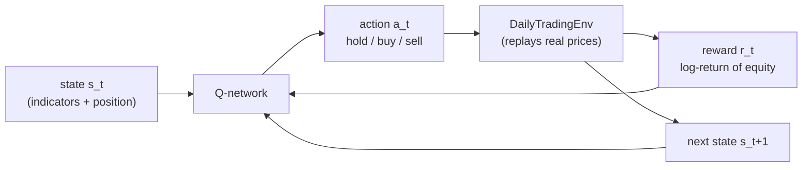
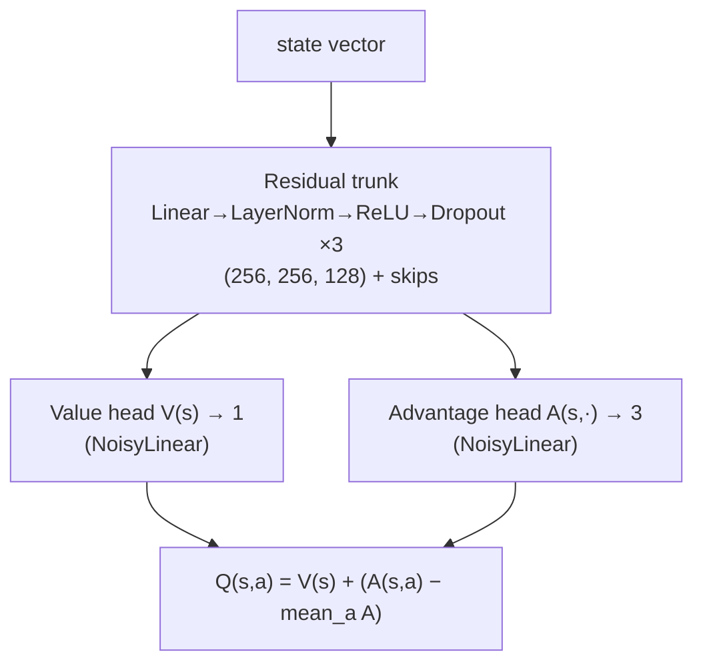

# The Science of the ROOF·SIM Trading Agent

A complete, code-grounded explanation of how the reinforcement-learning agent
works — the problem framing, the network architecture, the learning algorithm,
and the reasoning behind each choice.

> **TL;DR.** The agent is a **Dueling Double Deep Q-Network (DQN)** with
> **Noisy-Net exploration** and an optional **GRU / Transformer sequence encoder**.
> It learns to trade one instrument at a time on **daily candles** by maximizing the
> discounted sum of daily **log-returns of equity**, using only stationary technical
> indicators as its state.

**Contents**
1. [Reinforcement learning framing (the MDP)](#1-reinforcement-learning-framing-the-mdp)
2. [State: features & indicators](#2-state-features--indicators)
3. [Actions & reward](#3-actions--reward)
4. [Q-learning foundations](#4-q-learning-foundations)
5. [Network architecture](#5-network-architecture)
6. [The learning algorithm](#6-the-learning-algorithm)
7. [Exploration](#7-exploration)
8. [Training loop](#8-training-loop)
9. [Validation methodology](#9-validation-methodology)
10. [Hyperparameters](#10-hyperparameters)
11. [Design rationale](#11-design-rationale)
12. [Limitations](#12-limitations--honest-caveats)
13. [File map & glossary](#13-file-map--glossary)

---

## 1. Reinforcement learning framing (the MDP)

Trading is modeled as a **Markov Decision Process** `(S, A, P, R, γ)`:

- **S** — states (what the agent observes each day).
- **A** — actions (hold / buy / sell).
- **P** — transition dynamics (here: replaying a real price series, so transitions
  are deterministic given the action).
- **R** — reward (change in portfolio value).
- **γ** — discount factor (how much future reward is worth now).

The agent interacts with `DailyTradingEnv` (`daily_env.py`): each **episode** is one
ticker's daily history; each **step** is one trading day. The goal is a policy
`π(a | s)` that maximizes the expected **discounted return**:

```
G_t = r_t + γ·r_{t+1} + γ²·r_{t+2} + …  =  Σ_{k≥0} γ^k · r_{t+k}
```



---

## 2. State: features & indicators

The state is built from **stationary** technical indicators (ratios / normalized
values, not raw prices) so the network generalizes across tickers and price levels.
Features are grouped (`features.py`), and any subset can be selected per run:

| Group | Features | Formula (per day) |
|---|---|---|
| `prices` | ret_close, ret_open, ret_high, ret_low | `X / close_{t-1} − 1` for X ∈ {O,H,L,C} |
| `volume` | vol_ratio | `volume / SMA(volume,20) − 1` |
| `bollinger` | pct_b, bandwidth | `%B = (C−lower)/(upper−lower)`; `bw = (upper−lower)/mid`, Bollinger(14, 2σ) |
| `adx` | adx, +DI, −DI | Wilder ADX(14), each ÷ 100 |
| `obv` | obv_z | z-score of On-Balance-Volume over 50 days |

Two **position-context** scalars are appended so the agent knows its own state:

```
state = [ selected indicator features ] ++ [ position_flag, unrealized_return ]
```

- `position_flag` — 1 if currently long, else 0.
- `unrealized_return` — `close_t / entry_price − 1` while long, else 0.

**Sequence models** stack the last `W` days: the state is `W × F` features flattened
plus the 2 context scalars, and the network reshapes it back to `[batch, W, F]`.
So `state_dim = W · F + 2` (with `W = 1` for the plain MLP).

Warmup rows (any indicator still `NaN`) are **dropped, never filled** — no lookahead
and no fabricated data.

---

## 3. Actions & reward

**Action space** (discrete, 3 actions):

| Action | Meaning |
|---|---|
| 0 | **Hold** — do nothing |
| 1 | **Buy** — if flat, go all-in long at today's close |
| 2 | **Sell** — if long, liquidate to cash |

**Reward** — the **log-return of equity** from today to tomorrow:

```
r_t = ln( equity_{t+1} / equity_t )      (0 when flat and prices don't affect equity)
equity_t = cash_t + shares_t · close_t
```

Log-returns are used (instead of raw dollar P&L) because they are **additive over
time** (`Σ log-returns = log of total growth`) and **scale-free**, so a $600 stock and
a $30 stock contribute comparable reward magnitudes — essential when a single network
trains across a whole universe.

---

## 4. Q-learning foundations

The agent learns an **action-value function** `Q(s, a)` = the expected discounted
return from taking action `a` in state `s` and acting optimally thereafter. The
optimal Q satisfies the **Bellman optimality equation**:

```
Q*(s, a) = E[ r + γ · max_{a'} Q*(s', a') ]
```

A neural network `Q(s, a; θ)` approximates `Q*`. It is trained so that its prediction
matches a bootstrapped **target** `y` (temporal-difference learning); the loss is the
error between `Q(s,a;θ)` and `y`. The policy is then **greedy**: `π(s) = argmax_a Q(s,a)`.

---

## 5. Network architecture

Defined in `dqn_model.py`. Three ideas stack on top of a plain MLP: a **residual
trunk**, **dueling heads**, and **NoisyNet** layers — plus an optional **sequence
encoder**.



### 5.1 Residual, normalized trunk
Each block is `Linear → LayerNorm → ReLU → Dropout`, with a **skip connection** when
input and output widths match. LayerNorm (not BatchNorm) is used because RL does
inference on **single states** (batch size 1) — LayerNorm normalizes across features
and is batch-size independent, while BatchNorm would misbehave. Skips + normalization
keep a deeper stack trainable on noisy financial inputs.

### 5.2 Dueling heads
The trunk output feeds **two** heads that recombine into Q:

```
Q(s, a) = V(s) + ( A(s, a) − (1/|A|) Σ_{a'} A(s, a') )
```

- `V(s)` — how good is this **state** overall (one number).
- `A(s, a)` — the **advantage** of each action over the average.
- Subtracting the mean advantage makes the decomposition identifiable.

**Why it helps trading:** most days the correct action is *hold*, so the value of the
state carries almost all the signal. Dueling lets the net learn `V(s)` directly from
every transition instead of forcing that signal through three action-values.

### 5.3 NoisyNet exploration
The head layers are **`NoisyLinear`** (Fortunato et al., 2017): each weight is a
learnable mean plus a learnable noise scale,

```
y = (μ_W + σ_W ⊙ ε_W) · x + (μ_b + σ_b ⊙ ε_b)
```

with **factorized Gaussian** noise `ε_W = f(ε_out) · f(ε_in)ᵀ`, `f(x) = sgn(x)·√|x|`.
Fresh noise is sampled each step, so exploration is **state-dependent and learned**
(the network can dial noise up where it's uncertain and down where it's confident) —
strictly better than ε-greedy's uniform random actions, which are mostly meaningless
in markets. In `eval()` mode the noise is dropped and the layer uses `μ` only, giving
**deterministic greedy** behavior for validation.

### 5.4 Sequence encoder (GRU / Transformer)
With `--arch gru` or `--arch transformer` (`SequenceDuelingDQN`), the trunk becomes a
sequence encoder over the `W`-day window:

- **GRU:** `nn.GRU(F → d_model)`, take the **last** hidden state.
- **Transformer:** linear input projection + **learned positional encoding** +
  `TransformerEncoder`, take the **current-day** token.

The encoded window is concatenated with the position context and fed to the same
dueling+noisy heads. This lets the agent learn temporal patterns (momentum,
mean-reversion dynamics) that hand-crafted indicators don't fully capture.

---

## 6. The learning algorithm

Implemented in `dqn_agent.py`. It combines four standard stabilizers:

**1. Experience replay.** Transitions `(s, a, r, s', done)` are stored in a 50k
buffer; training samples **random mini-batches**, breaking the temporal correlation
that would otherwise destabilize gradient descent.

**2. Target network.** A second copy of the network, `Q_target(·; θ⁻)`, provides the
bootstrap target and is **hard-synced** from the online net every 10 episodes. A
slowly-changing target prevents the "chasing a moving target" divergence.

**3. Double DQN.** Vanilla DQN's `max` operator systematically **overestimates** Q.
Double DQN decouples action *selection* from *evaluation*:

```
a*   = argmax_{a'} Q_online(s', a'; θ)          # online net picks
y    = r + γ · Q_target(s', a*; θ⁻) · (1 − done) # target net scores
```

**4. Huber loss + gradient clipping.** The TD error is minimized with the **Huber
(smooth-L1)** loss — quadratic for small errors, linear for large ones, so outlier
rewards don't blow up the gradient — followed by gradient-value clipping. Optimizer:
**Adam**, `lr = 5e-4`.

```
L(θ) = Huber( Q_online(s, a; θ) − y )
```

---

## 7. Exploration

With **NoisyNet on** (default), exploration comes from the sampled network noise; the
policy is always `argmax`. With NoisyNet off, the agent falls back to **ε-greedy**:
act randomly with probability ε, else greedily, where ε decays `1.0 → 0.05` at rate
`0.997` per episode. Either way, at **validation** the network runs in `eval()` mode
(deterministic) so reported performance reflects the learned greedy policy.

---

## 8. Training loop

`train_daily.py`, per episode:

```
for episode in 1..N:
    ticker ← random training series
    env ← DailyTradingEnv(ticker, window=W)
    s ← env.reset()
    while not done:
        a ← agent.select_action(s)             # NoisyNet (or ε-greedy) exploration
        s', r, done ← env.step(a)              # advance one day, mark-to-market
        buffer.push(s, a, r, s', done)
        agent.train_step(batch)                # sample batch, Double-DQN TD update
        s ← s'
    if episode % 10 == 0: sync target network
    decay ε
    every `val_every` episodes:                # greedy validation on held-out split
        m ← evaluate(agent, val_set)
        if m improved: save best checkpoint     # model always persists
```

A per-episode row (return + loss + validation metrics) is written to
`train_log.csv`, and a live progress bar + validation sparkline render in the
terminal / the Agent Lab GUI.

---

## 9. Validation methodology

- **No lookahead across the split.** The dataset is split **temporally per ticker** —
  the agent trains on the earlier part of each ticker's history and is validated on
  the **most recent** slice, which comes strictly after everything it trained on.
- **Greedy & deterministic.** Validation runs the network in `eval()` mode
  (NoisyNet → means, dropout off), so the tape reflects the actual learned policy.
- **Metrics** (`validate.py`): mean / median return, **% profitable**, return vs a
  **buy-&-hold baseline** (the honest benchmark), and a return/volatility
  ("sharpe-like") ratio — plus a **day-by-day BUY/SELL tape** and equity curve.

---

## 10. Hyperparameters

| Parameter | Default | Where |
|---|---|---|
| Discount γ | 0.99 | `DQNAgent` |
| Learning rate (Adam) | 5e-4 | `DQNAgent` |
| Replay buffer | 50,000 | `DQNAgent` |
| Batch size | 128 | `train_daily` |
| Target sync | every 10 episodes (hard) | `train_daily` |
| Trunk hidden | (256, 256, 128) | `DuelingDQN` |
| Dropout | 0.1 | `DuelingDQN` |
| NoisyNet σ₀ | 0.5 | `NoisyLinear` |
| ε (if NoisyNet off) | 1.0 → 0.05, decay 0.997 | `DQNAgent` |
| Sequence d_model / layers / heads | 128 / 2 / 4 | `SequenceDuelingDQN` |
| Loss | Huber (smooth-L1) | `DQNAgent` |
| Actions | 3 (hold/buy/sell) | env |

---

## 11. Design rationale

- **Log-return reward** → additive, scale-free, comparable across tickers.
- **Stationary features** → the network sees regime-independent inputs, not price
  levels it has never seen.
- **Dueling** → separates "good state?" from "which action?", ideal when *hold*
  dominates.
- **Double DQN** → removes the optimistic bias that makes plain DQN over-trade.
- **NoisyNet** → learned, state-aware exploration instead of blind randomness.
- **LayerNorm (not BatchNorm)** → correct for batch-size-1 action selection.
- **Sequence encoder (optional)** → captures temporal structure beyond indicators.
- **Temporal validation split** → an honest estimate of out-of-sample performance.

---

## 12. Limitations & honest caveats

The agent is a research/educational model, **not** a trading system:

- **No transaction costs or slippage** — fills at the daily close; real costs would
  reduce (often erase) edge, especially for high-turnover policies.
- **Long / flat only** on the daily agent (no shorting; the interactive simulator
  supports shorts, the DQN does not).
- **All-in position sizing** — buy = 100% of cash; no risk-scaled sizing.
- **Fills at the close** — no intraday execution modeling.
- **Daily granularity** — no microstructure; the crypto order-book realism lives in
  the *simulator*, not in this daily agent.
- **Q-learning is off-policy & can be unstable** — results vary run to run; validate
  against buy-&-hold and treat single runs skeptically.

---

## 13. File map & glossary

**Code**
- `features.py` — indicator groups & stationary feature construction.
- `daily_env.py` — the MDP (state, actions, reward, episode).
- `dqn_model.py` — `NoisyLinear`, `DuelingDQN`, `SequenceDuelingDQN`, replay buffer.
- `dqn_agent.py` — Double-DQN learning (replay, target net, loss, optimizer).
- `train_daily.py` / `validate.py` / `experiment.py` — training, validation, runner.

**Glossary**
- **Q-value** — expected discounted return of an action in a state.
- **TD (temporal-difference) learning** — updating estimates toward a bootstrapped
  target that mixes the observed reward with the next state's estimate.
- **Bootstrapping** — using the model's own next-state estimate inside its target.
- **Off-policy** — learning the greedy policy while behaving with exploration.
- **Advantage** — how much better an action is than the state's average action.

**References** — Mnih et al. 2015 (DQN); van Hasselt et al. 2016 (Double DQN);
Wang et al. 2016 (Dueling); Fortunato et al. 2017 (NoisyNet); Cho et al. 2014 (GRU);
Vaswani et al. 2017 (Transformer).
